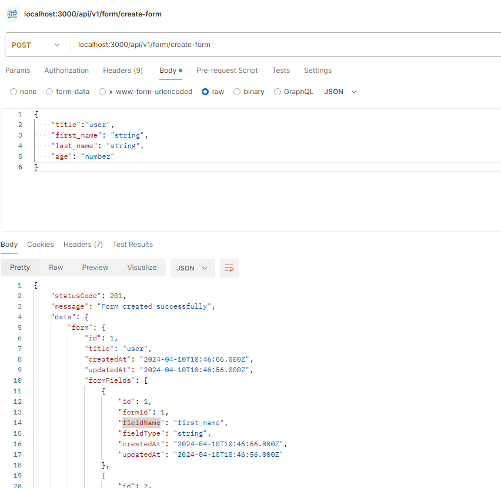
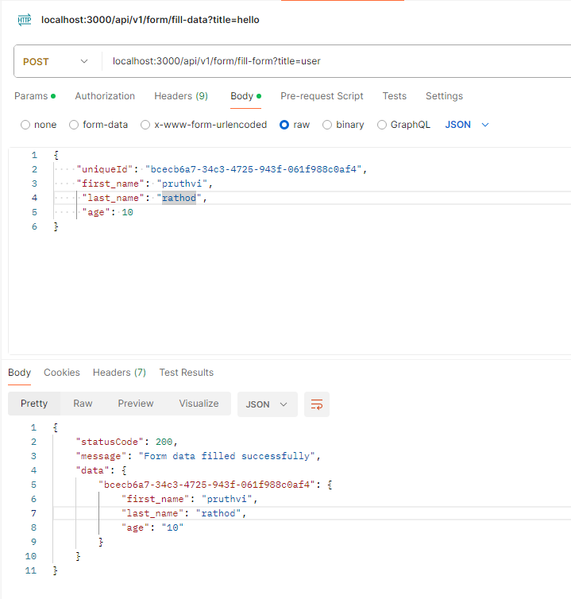

## Dynamic Form Module
    - Purpose of dynamic form module is to create dynamically different types of forms, fields for form and insert data in created form.
    - Module is created in based on boilerplate project and following naming conventions and standards.
    
## Basic Objectives of Modules:
    - Create dynamic form having title of form and dynamic fields given in bodydata
    - Insert form data, body has form data and in query string title of form
    - Get all insert data fetch by title

## Setup for development:
    - npm ci
    - npm install -g win-node-env
    - docker-compose -f .\docker-compose.local.yml up -d
    - npm run start:dev

## Entities
     Form - stores title of form has one to many relationship with FormField and one to many relationship with FormData
     FormField - stores id, formId and fieldName and fieldType
     FormData - stores uniqueId, formId, formFieldId and fieldValue

## End Points (Form Controller functions)
    /create-form - Post request to create form and form fields
    /fill-form?title={title} - Post request to insert data to the form given in query parameter title.
    /get-data - Get request to get all inserted form given in query parameter title.

## Service (Form Service)
    Provides basic functions like createFormAndFields, fillFormData, findFormData, transformData

## Repositories
    Defined repository file for each entity FormRepository, FormFieldRepository, FormDataRepository.
    Repository has create and find function to create record and fetch data.
    Used sequilize orm function to run query

## Validation
    Basic validation likes 
    - title value must be string 
    - supported data types by dynamic form
    - form data must be saved as form field data type. 
    
## Custom Exceptions
    Form not found form given title. 
    Invalid type of filedValue as per fieldType given for filedName.

## Design patterns
    MVC with service, repository and dto.

## Scalablity